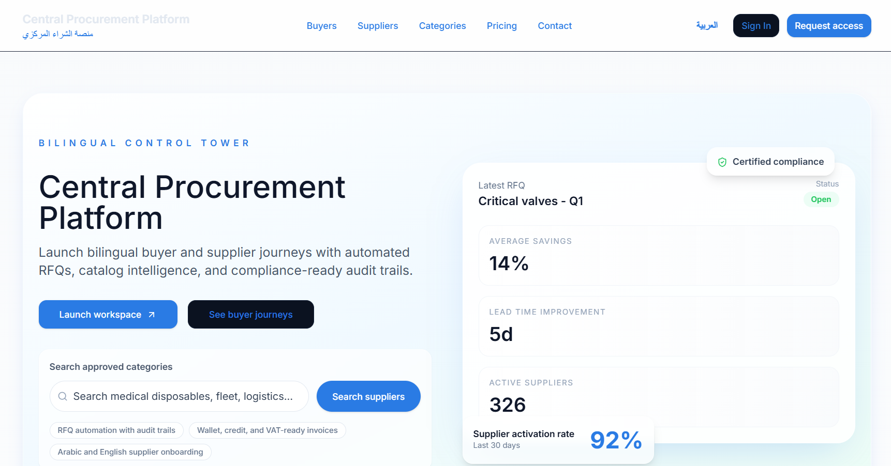
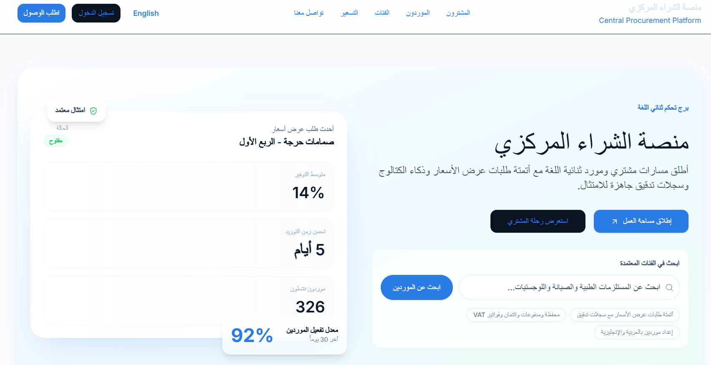
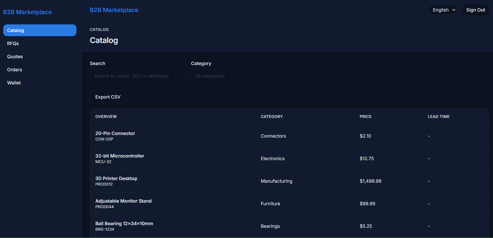
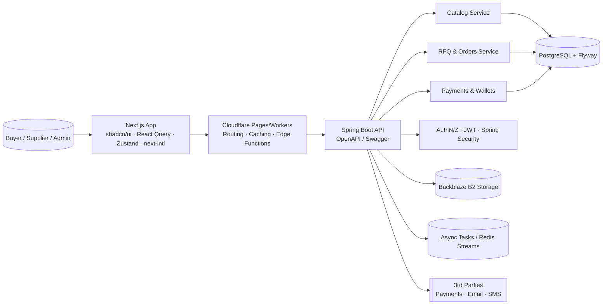
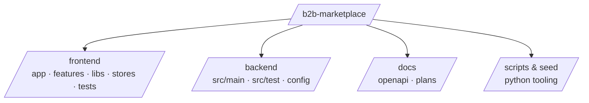

# منصة الشراء المركزي — Centralized Procurement Platform

              

## Table of Contents
- [Overview](#overview)
- [Screenshots](#screenshots)
- [Architecture](#architecture)
- [API Docs](#api-docs)
- [Features](#features)
- [Tech Stack](#tech-stack)
- [Quick Start](#quick-start)
- [Scripts](#scripts)
- [CI/CD](#cicd)
- [Security & Quality](#security--quality)
- [Roadmap](#roadmap)
- [Contributing](#contributing)
- [License](#license)

## Overview
Centralized Procurement Platform is a bilingual B2B marketplace that lets enterprise buyers browse catalog data, issue RFQs, compare supplier quotes, convert to orders, and settle wallets/payments through one cohesive workflow. The Next.js 14 frontend ships on Cloudflare Pages for edge-localized RTL/LTR rendering, while a Spring Boot 3 API on Azure App Service orchestrates catalog, RFQ, wallet, and admin capabilities exposed via OpenAPI. Feature flags, JWT auth, and modular services make the solution production-ready while still in pilot/alpha rollout.  

م  
**Live Demo:** [<DEPLOY_URL>](https://b2b-marketplace.pages.dev/en)

## Screenshots
<p align="center">
  
  
</p>
<p align="center"><sub>Hero experience highlighting buyers vs. suppliers in both LTR and RTL layouts.</sub></p>
<p align="center">
  
</p>
<p align="center"><sub>Catalog & search workspace with feature-flagged RFQ entry points.</sub></p>

## Architecture




## API Docs
**Swagger/OpenAPI:** <SWAGGER_URL> (spec in [docs/openapi.yaml](docs/openapi.yaml))  
Regenerate client hooks via `pnpm gen:api` (Next.js) and refresh server contracts with `./mvnw verify` (Spring Boot).

## Features
- Role-aware navigation for buyers, suppliers, and admins with JWT session storage and feature flags.
- Catalog browsing, deep product attributes, debounced search, and public/preview gating via `catalog.publicBrowse`.
- RFQ → quote → order workflow, including supplier inbox, quote comparison, approvals, and wallet-backed checkout.
- Wallet balances, payments integration (`wallet.basic`, `payments.gateway1`), and invoice/VAT/credit controls toggled at runtime.
- next-intl localization + Tailwind RTL utilities provide instant Arabic ↔ English switching with accessible typography.
- Responsive shadcn/ui system, toast-driven UX, and React Query caching for offline-friendly interactions.

## Tech Stack
| Frontend | Backend & Infra |
| --- | --- |
| Next.js 14.2.5, React 18.3, TypeScript 5.4, shadcn/ui, Tailwind CSS 3.4, React Query 5, Zustand 4, next-intl, pnpm 8, Vitest, Playwright, ESLint + Prettier | Spring Boot 3.2, Java 21, Maven Wrapper, Spring Security/JWT, Micrometer + Prometheus, Flyway, PostgreSQL, Redis/Upstash, Backblaze B2, OpenAPI 3, Docker, Cloudflare Pages, Azure App Service |

## Quick Start
### Prerequisites
- Node.js 18.17+ (CI runs on 22.x) with `corepack enable` or pnpm ≥ 8.15
- Java 21 + Maven Wrapper (`./mvnw`)
- PostgreSQL 15+ (or Neon/Cloud DB) and Redis (optional, feature-flag friendly)
- Python 3.11+ for database seed scripts

### Frontend (Cloudflare-ready Next.js)
```bash
cd frontend
pnpm install
pnpm dev   # http://localhost:3000/en
pnpm lint && pnpm typecheck && pnpm test:unit && pnpm e2e
```

### Backend (Spring Boot API)
```bash
cd backend
./mvnw flyway:migrate
./mvnw spring-boot:run  # API at http://localhost:8080
```

## Scripts
| Target | Command | Purpose |
| --- | --- | --- |
| Frontend | `pnpm dev` | Next.js dev server with locale + feature-flag bootstrap |
| Frontend | `pnpm build` / `pnpm start` | Production build + preview (Cloudflare Pages output) |
| Frontend | `pnpm lint`, `pnpm typecheck`, `pnpm test:unit`, `pnpm e2e` | Quality gates (ESLint, TS, Vitest, Playwright) |
| Frontend | `pnpm gen:api` | Regenerate typed API clients & React Query hooks from OpenAPI |
| Backend | `./mvnw spring-boot:run` | Run API with hot reload |
| Backend | `./mvnw verify` | Unit + integration tests, Flyway validation |
| Tooling | `python3 seed/scripts/seed_data.py` | Bootstrap database + feature flags |

## CI/CD
- **ci-cd.yml** — pnpm lint/typecheck/test/build, Playwright e2e, and Cloudflare Pages deployment.
- **monorepo.yml** — Full-stack pipeline with Postgres service, Maven verify, frontend lint/tests, and Azure-ready deploy artifact.
- **flyway-repair.yml** — Manual Neon DB repair guardrail.
- **master_b2b-marketplace.yml** — Build + deploy the Spring Boot JAR to Azure App Service.

## Security & Quality
- Spring Security + JWT, request filtering by feature flag (catalog/search/RFQ) and strict CORS.
- Secrets isolated via GitHub Actions + Cloudflare secrets; object storage handled through Backblaze B2 credentials.
- Micrometer/Actuator expose metrics for Prometheus; CI enforces ESLint, TypeScript, Vitest, Playwright, and Maven verify.
- Run local accessibility/performance audits with `pnpm dlx @lhci/cli autorun` (update Lighthouse baselines before PRs).
- Coding standards: Prettier, ESLint strict config, and imperative commit subjects per repository guidelines.

## Roadmap
- Vendor onboarding wizard with document verification and SLA policies.
- Advanced federated search (semantic filters, saved views, Arabic morphology tweaks).
- Quote negotiation threads with notifications (email/SMS) and audit trails.
- Order orchestration with split shipments, partial invoices, and credit approval workflows.
- Analytics dashboards (spend, supplier KPIs) plus export to BI tools.
- In-app announcements + feature flag rollout console surfaced to admins.
- Payment gateway expansion (Stripe, HyperPay) and multi-currency wallets.
- Compliance automation: e-invoicing, tax codes, and retention policies.

## License
Released under the [MIT License](LICENSE).

---
By Ahmed Mahmoud — [](https://www.linkedin.com/in/ahmedmmkms/) · 
